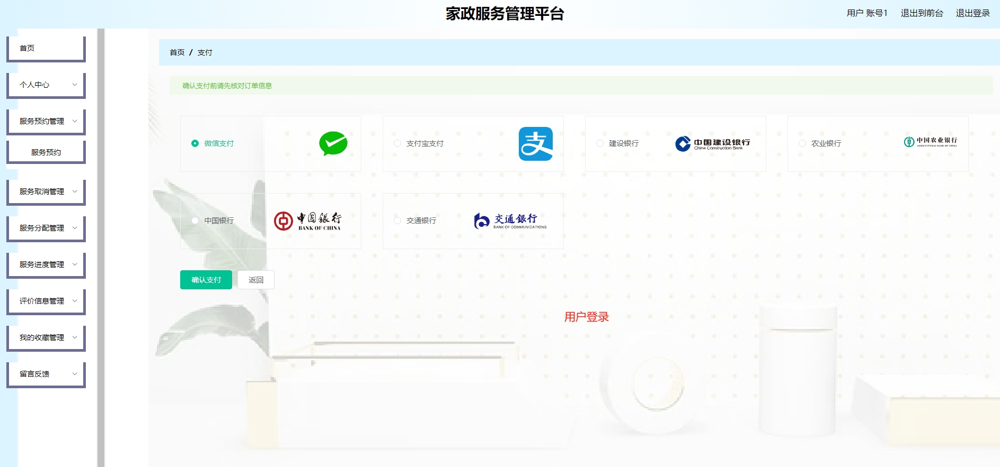
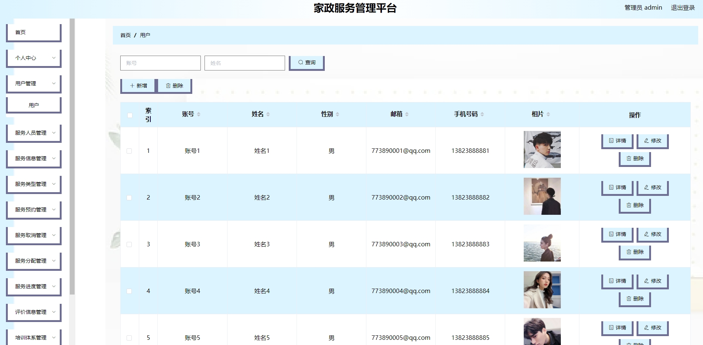
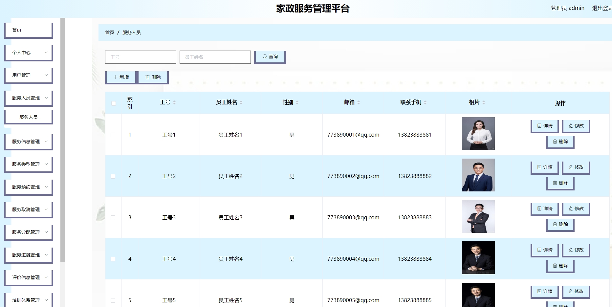
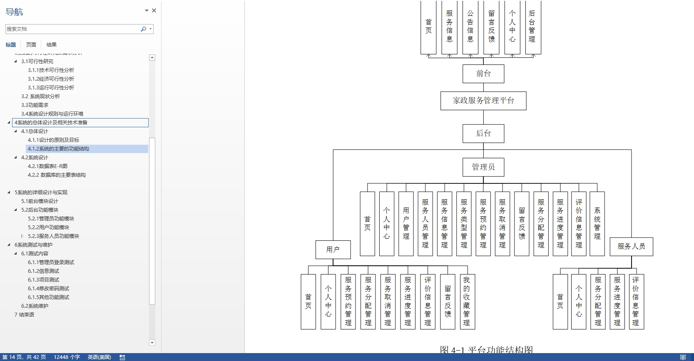

# 1.项目介绍
- 系统角色：管理员、服务人员员、普通用户
- 功能模块：用户管理、服务人员管理、服务信息管理、服务预约管理、服务类型管理、服务分配管理、服务进度管理、评价管理、培训体系管理等
- 技术选型：SpringBoot，vue（后端管理web），LayUI等
- 测试环境：idea2024，jdk1.8，mysql5.7，maven3，node14.16.1
# 2.项目部署
## 2.1 后端部署
- 创建数据库，导入sql文件
- idea打开目录server，根据本地数据库环境修改src/main/resources/application.yml 11-14行
- 启动项目src/main/java/com/hrm/SpringbootSchemaApplication.java
- 门户web：http://localhost:8080/springbootm7qt4/front/index.html
## 2.2 管理web
- idea（安装vue.js插件）或者webstorm、vscode等ide工具打开项目client(命令行操作也可以）
- 进入终端，输入 npm install安装依赖（下载失败自行配置阿里的镜像加速）
- 启动项目 npm run serve
- 打开终端的地址，输入账号密码：管理员（admin、123456）其他自行查表
# 3.项目部分截图

# 4.获取方式
[戳我查看](https://gitee.com/aven999/mall)
